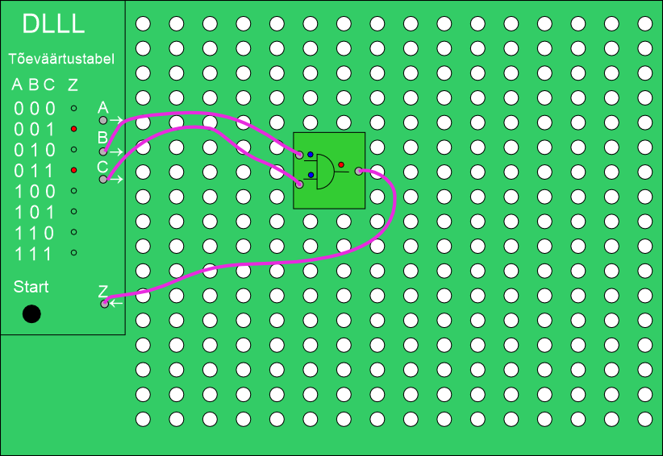

# Digiloogika leivalaud (DLLL)

## **Ülevaade**
**Digiloogika Leivalaud (DLLL)** on õppevahend digitaalloogika skeemide koostamiseks. Seade võimaldab visuaalselt ja praktiliselt mõista digitaalloogika põhialuseid, kasutades erinevaid loogikaelemente nagu **2NOR, NOT, AND, OR jne**. 

  

## **Omadused**
✔ **Modulaarne disain** – loogikaelemente sisaldavad klotsid saab lihtsalt vahetada.
✔ **Aukudega aluslaud** – mugav ja stabiilne paigutus erinevatele elementidele.
✔ **3.5 mm patch ( [Eurorack patch](https://i0.wp.com/intellijel.com/wp-content/uploads/2023/04/cable-pack-2023-0.jpg?resize=544%2C408&ssl=1) ) kaablite ühendused** – kiire ja lihtne ühenduste loomine.
✔ **Õppevahend elektroonika ja digitaalloogika kursustele**.

Klotside toide ja loogika signaal peab liikuma läbi kahe soone. Kasutame patch kaablites toite reverseerimist:

✅ **ON:**  
-  **Rõngas** = **-**  
-  **Ots** = **+**  

❌ **OFF:**  
-  **Rõngas** = **+**  
-  **Ots** = **-**  

## **Kasutusala**
DLLL on mõeldud kasutamiseks **elektroonika ja digitaalloogika kursustel** ning võimaldab:
- **Praktiliselt katsetada loogikaväravate tööd.**
- **Kombineerida ja luua erinevaid digitaalseid skeeme.**
- **Arendada loogilist mõtlemist ja digitaalloogika oskusi.**

## **Projekti info**
- **Kursus:** TS.0028 Elektroonikaseadmete projekteerimine ja tootmine
- **Õppeasutus:** Eesti Maaülikool (EMÜ)
- **Õppejõud:** Dr. Heiki Lill
- **Õppeassistent:** Priit Humal

## **Paigaldus ja kasutamine**
1. Aseta vajalikud **loogikaelementide klotsid** alusele.
2. Ühenda klotsid **3.5 mm patch kaablitega** vastavalt skeemile.
3. Lülita süsteem sisse ja kontrolli loogika tööpõhimõtteid.
4. Muuda skeemi ja eksperimenteeri erinevate loogikaväravate kombinatsioonidega.

## **Failid ja dokumentatsioon**
📄 **Dlll.docx** – projekti lähteülesanne.
📄 **Skeemid/** – erinevad näidisskeemid DLLL kasutamiseks.
📄 **Juhendid/** – kasutusjuhendid ja õpetused.

## **Autorid ja kontakt**
📩 **Projekti juhendaja:** Dr. Heiki Lill (heiki.lill@emu.ee)
📩 **Õppeassistent:** Priit Humal (priit.humal@emu.ee)
📩 **Kursuse info:** [EMÜ TS.0028 Elektroonikaseadmete projekteerimine ja tootmine](https://www.emu.ee)

---
💡 **Kasulikud lingid**  
🔗 [Digitaalloogika baasteadmised](https://en.wikipedia.org/wiki/Digital_logic)  

🚀 **Head eksperimenteerimist!**
